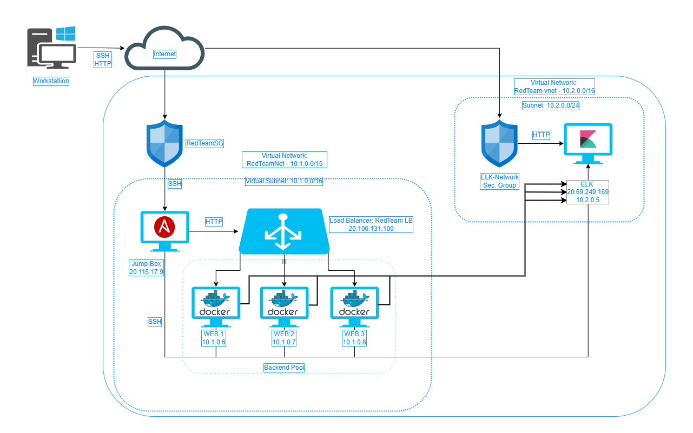

# Cloud Security Project 1 - ELK stack

## Automated ELK Stack Deployment

The files in this repository were used to configure the network depicted below.



These files have been tested and used to generate a live ELK deployment on Azure. They can be used to either recreate the entire deployment pictured above. Alternatively, select portions of the [install-elk.yml](Resources/Scripts/install-elk.yml) file may be used to install only certain pieces of it, such as Filebeat.

```
- name: Configure Elk VM with Docker
  hosts: elk
  remote_user: azadmin
  become: true
  tasks:
    # Use apt module
    - name: Install docker.io
      apt:
        update_cache: yes
        name: docker.io
        state: present

      # Use apt module
    - name: Install pip3
      apt:
        force_apt_get: yes
        name: python3-pip
        state: present

      # Use pip module
    - name: Install Docker python module
      pip:
        name: docker
        state: present

      # Use sysctl module
    - name: Use more memory
      sysctl:
        name: vm.max_map_count
        value: "262144"
        state: present
        reload: yes

      # Use docker_container module
    - name: download and launch a docker elk container
      docker_container:
        name: elk
        image: sebp/elk:761
        state: started
        restart_policy: always
        published_ports:
          - 5601:5601
          - 9200:9200
          - 5044:5044

      # Use systemd module
    - name: Enable service docker on boot
      systemd:
        name: docker
        enabled: yes        
```


This document contains the following details:
- Description of the Topologu
- Access Policies
- ELK Configuration
  - Beats in Use
  - Machines Being Monitored
- How to Use the Ansible Build


### Description of the Topology

The main purpose of this network is to expose a load-balanced and monitored instance of DVWA, the D*mn Vulnerable **Web** Application.

Load balancing ensures that the application will be highly [available](https://www.fortinet.com/resources/cyberglossary/cia-triad), in addition to restricting access to the network. Therefore better resisting DDoS attacks.

The [Jumpbox](https://docs.microsoft.com/en-us/learn/modules/connect-vm-with-azure-bastion/), or Bastion Host, ensures that for any administrative tasks, the deployment is made in a safe enviroment. We must connect to the Jumpbox using RDP or SSH and then perform any activities from whithin it. In this case, we must allow connections to the JumpBox VM from only our IP using a Network Security Group: **RedTeamSG**. 


Integrating an ELK server allows users to easily monitor the vulnerable VMs for changes to the files and system logs and metrics.

- [FileBeat](https://www.elastic.co/guide/en/beats/filebeat/current/filebeat-overview.html#:~:text=Filebeat%20is%20a%20lightweight%20shipper,Elasticsearch%20or%20Logstash%20for%20indexing): Watches for changes to logged data in specific log files we specify, usually the Elasticsearch or Logstash.
- [Metric Beat](https://www.elastic.co/guide/en/beats/metricbeat/current/metricbeat-overview.html#:~:text=Metricbeat%20is%20a%20lightweight%20shipper,such%20as%20Elasticsearch%20or%20Logstash): Collects metrics from the OS and/or services running on the machine and delivers the data to a set output, usually the Elasticsearch or Logstash.


| Name     | Function | IP Address | Operating System   |
|----------|----------|------------|--------------------|
| Jump Box | Gateway  | 10.1.0.4   | Linux Ubuntu Server|
| WEB-1    | Server   | 10.1.0.6   | Linux Ubuntu Server|
| WEB-2    | Server   | 10.1.0.7   | Linux Ubuntu Server|
| WEB-3    | Server   | 10.1.0.8   | Linux Ubuntu Server|
| ELK      | Server   | 10.2.0.5   | Linux Ubuntu Server|

### Access Policies

The machines on the internal network are not exposed to the public Internet. 

Only the **JumpBox** and the **ELK** machines can accept connections from the Internet. Access to these machines is only allowed from the following public IP addresses:
- WorkstationIP

Machines within the network can only be accessed by **JumpBox**.
  - The only machine allowed to SSH into the ELK VM is the **JumpBox**

A summary of the access policies in place can be found in the table below.

| Name     | Publicly Accessible | Allowed IP Addresses |
|----------|---------------------|----------------------|
| JumpBox  | Yes                 |   WorkstationIP      |
| WEB-1    | NO                  |    10.1.0.4          |
| WEB-2    | NO                  |    10.1.0.4          |
| WEB-3    | NO                  |    10.1.0.4          |

### Elk Configuration

Ansible was used to automate configuration of the ELK machine. No configuration was performed manually, which is advantageous because...
- Reduces the number of errors - We may use tested templates to orchestrates complex IT infrastructures
- Simplicity: With short scripts or **playbooks**, we are able deploy and configure a large number of VMs 

The playbook implements the following tasks:
- Install docker.io
- Install PIP
- Install docker python module
- Download and Install a Docker elk container
- run command to increase the memory

The following screenshot displays the result of running `docker ps` after successfully configuring the ELK instance.


### Target Machines & Beats
This ELK server is configured to monitor the following machines:
- _TODO: List the IP addresses of the machines you are monitoring_

We have installed the following Beats on these machines:
- _TODO: Specify which Beats you successfully installed_

These Beats allow us to collect the following information from each machine:
- _TODO: In 1-2 sentences, explain what kind of data each beat collects, and provide 1 example of what you expect to see. E.g., `Winlogbeat` collects Windows logs, which we use to track user logon events, etc._

### Using the Playbook
In order to use the playbook, you will need to have an Ansible control node already configured. Assuming you have such a control node provisioned: 

SSH into the control node and follow the steps below:
- Copy the _____ file to _____.
- Update the _____ file to include...
- Run the playbook, and navigate to ____ to check that the installation worked as expected.

_TODO: Answer the following questions to fill in the blanks:_
- _Which file is the playbook? Where do you copy it?_
- _Which file do you update to make Ansible run the playbook on a specific machine? How do I specify which machine to install the ELK server on versus which to install Filebeat on?_
- _Which URL do you navigate to in order to check that the ELK server is running?

_As a **Bonus**, provide the specific commands the user will need to run to download the playbook, update the files, etc._